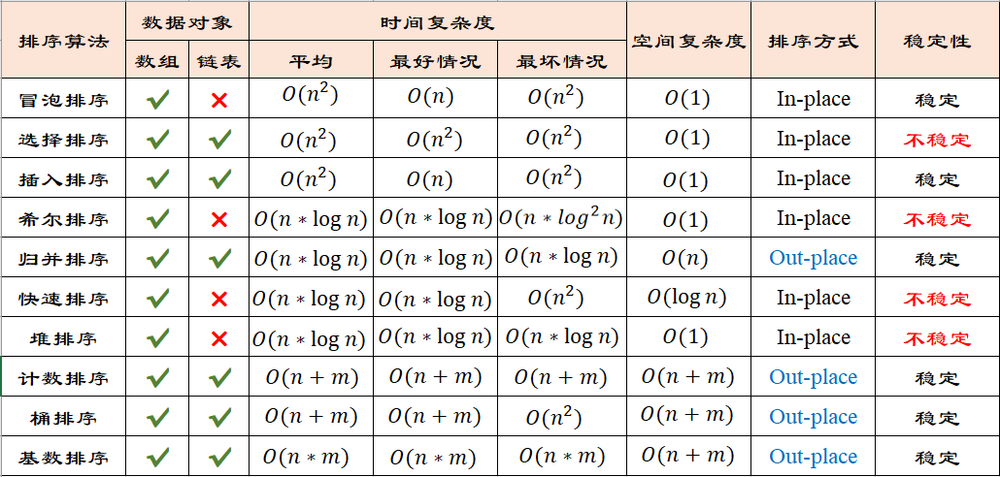

### 排序算法

排序算法可以分为内部排序和外部排序，**内部排序**是数据记录在内存中进行排序，而**外部排序**是因排序的数据很大，一次不能容纳全部的排序记录，在排序过程中需要访问外存。【*图片来自网络*】




#### 冒泡排序

> 顾名思义，就像一堆气泡，大的气泡往上冒，一次遍历完的结果是待排序的气泡中最大的气泡冒出到有序序列。

【步骤】

1. 从第一个元素开始比较相邻元素，若前者更大，则交换这两个元素；
2. 一次遍历完，一个元素完成有序；
3. 重复第一步，直到所有元素有序。

【**优化**】**当一次遍历结束，没有发生交换，整个序列便已完成排序。**

```cpp
/**
 * 冒泡排序
 * 稳定性：稳定
 * 时间复杂度：O(n*n)
 * 空间复杂度：O(1)
**/
template<class T>
void bubble_sort(vector<T>& nums){
    int n = nums.size();
    bool flag = false; // 优化 一次遍历是否发生交换
    while(n > 1){
        for(int i = 0; i+1 < n; ++i){
            if(nums[i] > nums[i+1]){
                swap(nums[i], nums[i+1]);
                flag = true;
            }
        }
        if(!flag)	break;
        flag = false;
        --n;
    }
}
```

#### 选择排序

> 每次遍历，选择待排序元素中最大元素，放置到待排序子数组最后位置。一次遍历至多只进行交换一次。

【步骤】

1. 遍历待排序子数组，选择最大待排序元素；
2. 将待排序最大元素放置在待排序子数组最后位置；
3. 重复第一步，直到所有元素有序。

```cpp
/**
 * 选择排序
 * 稳定性：不稳定（可能打破原来元素的相对位置）
 * 时间复杂度：O(n*n)
 * 空间复杂度：O(1)
**/
template<class Type>
void select_sort(vector<Type>& nums){
    int n = nums.size();
    while(n > 1){
        int max_index = 0;
        for(int i = 1; i < n; ++i){
            if(nums[max_index] < nums[i])
                max_index = i;
        }
        swap(nums[max_index], nums[n-1]);
        --n;
    }
}
```

#### 插入排序

> 将待排序元素依次插入有序序列

【步骤】

1. 将第一个元素视为有序序列，往后为待排序序列；
2. 依次向有序序列插入元素到合适的位置。

```cpp
/**
 * 插入排序
 * 稳定性：稳定
 * 时间复杂度：O(n*n)
 * 空间复杂度：O(1)
**/
template<class Type>
void insert_sort(vector<Type>& nums){
    int n = nums.size();
    for(int ordered = 1; ordered < n; ++ordered){
        Type value = nums[ordered];
        int i = ordered - 1;
        while(i >= 0 && nums[i] > value){
            nums[i+1] = nums[i];
            --i;
        }
        nums[i+1] = value;
    }
}
```

#### 希尔排序

> 也称递减增量排序算法，希尔排序是基于插入排序的以下两点性质而提出改进方法的：
>
> - 插入排序在对几乎已经排好序的数据操作时，效率高，即可以达到线性排序的效率；
> - 但插入排序一般来说是低效的，因为插入排序每次只能将数据移动一位；

【图解】

参考：https://www.cnblogs.com/chengxiao/p/6104371.html

```cpp
/**
 * 希尔排序
 * 稳定性：不稳定（可能打破原来元素的相对位置）
 * 时间复杂度：O(nlogn)
 * 空间复杂度：O(1)
**/
template<class Type>
void shell_sort(vector<Type>& nums) {
    int n = nums.size();
    for (int gap = n / 2; gap > 0; gap /= 2) { // 增量 gap
        for (int i = gap; i < n; ++i) {
            int value = nums[i];
            int j = i;
            // 增量为 gap 的子序列【插入排序】
            while (j >= gap && value < nums[j - gap]) { 
                nums[j] = nums[j - gap];
                j -= gap;
            }
            nums[j] = value;
        }
    }
}
```

#### 归并排序

> 归并排序采用分而治之的思想。将原序列均分为两个子序列，选排序子序列，再合并有序子序列。

【图解】

参考：https://www.cnblogs.com/chengxiao/p/6194356.html

```cpp
/**
 * 归并排序
 * 稳定性：稳定
 * 时间复杂度：O(n*logn)
 * 空间复杂度：O(n)
**/
template<class Type>
void _sort(vector<Type>& nums, int start, int end) {
    if (start >= end)
        return;
    int mid = start + (end - start) / 2;
    // 递归
    _sort(nums, start, mid);    // [start, mid]
    _sort(nums, mid + 1, end);  // [mid+1, end]
    // 合并
    vector<Type> temp(end - start + 1, 0); // 暂存数组 可只使用一个 O(n)
    int left = start, right = mid + 1, t = 0;
    while (left <= mid && right <= end) {
        if (nums[left] <= nums[right])
            temp[t++] = nums[left++];
        else
            temp[t++] = nums[right++];
    }
    while(left <= mid)
        temp[t++] = nums[left++];
    while(right <= end)
        temp[t++] = nums[right++];
    // 拷贝暂存的有序序列
    t = 0;
    while (start <= end){
        nums[start++] = temp[t++];
    }
}

template<class Type>
void merge_sort(vector<Type>& nums){
    _sort(nums, 0, nums.size() - 1);
}
```

#### 快速排序

【步骤】

1. 待排序列中取一个“基准”
2. 所有比“基准”小的元素放”基准“前面，所有比“基准”大的元素放“基准”后面。
3. 递归处理基准两侧的子序列。

```cpp
/**
 * 快速排序
 * 稳定性：不稳定（可能打破原来元素的相对位置）
 * 时间复杂度：O(n*logn)
 * 空间复杂度：O(logn)
**/
template<class Type>
void _quick_sort(vector<Type>& nums, int start, int end) {
    if (start >= end)
        return;
    // 基准 nums[start]
    int low = start, high = end;
    while (low < high) {
        while (low < high && nums[high] >= nums[start])  // 先从右找小于基准
            --high;
        while (low < high && nums[low] <= nums[start])   // 再从左找大于基准
            ++low;
        if (low < high)
            swap(nums[low], nums[high]);
    }
    // 最后将基准归位
    swap(nums[start], nums[low]);  
    // 递归
    _quick_sort(nums, start, low - 1);
    _quick_sort(nums, low + 1, end);
}

template<class Type>
void quick_sort(vector<Type>& nums) {
    _quick_sort(nums, 0, nums.size() - 1);
}
```

#### 堆排序

> 堆排序将待排序数组视为静态二叉树组。

【步骤】

1. 构建（大顶）堆：此处从有孩子的结点开始调整；
2. 取堆顶元素与末尾元素交换；
3. 调整堆结构，循环执行，直到所有元素有序。

```cpp
/**
 * 堆排序
 * 稳定性：不稳定（可能打破原来元素的相对位置）
 * 时间复杂度：O(n*logn)
 * 空间复杂度：O(1)
**/
// 自顶向下调整堆 [start, end]
template<class Type>
void adjustMaxHeap(vector<Type>& nums, int start, int end) {
    int dad = start; // 父结点
    int son = dad * 2 + 1;  // 子结点
    while (son <= end) {
        // 选择较大的子结点
        if (son + 1 <= end && nums[son] < nums[son + 1]) {
            ++son;
        }
        if (nums[son] <= nums[dad]) // 满足大顶堆条件
            break;
        else { // 不满足大顶堆添加 交换父子结点 继续向下调整
            swap(nums[dad], nums[son]);
            dad = son;
            son = dad * 2 + 1;
        }
    }
}

template<class Type>
void heap_sort(vector<Type>& nums) {
    int n = nums.size();
    // 1. 构建堆 从第一个有孩子的结点开始调整
    for (int i = n / 2 - 1; i >= 0; --i) {
        adjustMaxHeap(nums, i, n - 1);
    }
    // 2. 依次取最大元素放置末尾
    --n;
    while (n > 0) {
        swap(nums[0], nums[n]);
        adjustMaxHeap(nums, 0, --n);
    }
}
```

#### 计数排序

> 计数排序算法思想就是先遍历一遍得到所有元素的值区间[min, max]，然后使用临时数组统计区间中每个值出现的次数，再得到小于等于该元素的元素个数，便得到该元素放在目标数组中的位置，最后给目标数组赋值。

【步骤】

1. 得到待排序序列的最值 [min, max]；
2. 统计 [min, max] 中值出现的次数；
3. 对所有的计数累加，得到小于等于该元素的个数（即该元素排序的位置）；
4. 反向填充临时数组；
5. 赋值目标数组

```cpp
/**
 * 计数排序
 * 稳定性：稳定
 * 时间复杂度：O(m+n)
 * 空间复杂度：O(m+n)
**/
template<class Type>
void counting_sort(vector<Type>& nums) {
    int n = nums.size();
    if (n <= 1)
        return;
    // 1. 得到待排序序列的最值 [min, max]
    int min = nums[0];
    int max = nums[0];
    for (int i = 1; i < n; ++i) {
        if (min > nums[i])
            min = nums[i];
        else if (max < nums[i])
            max = nums[i];
    }
    // 2. 统计 [min, max] 中值出现的次数
    int n_count = max - min + 1;
    vector<Type> count(n_count, 0);
    for (int i = 0; i < n; ++i) {
        ++count[nums[i] - min];
    }
    // 3. 对所有的计数累加，得到小于等于该元素的个数（即该元素排序的位置）
    for (int i = 1; i < n_count; ++i) {
        count[i] += count[i - 1];
    }
    // 4. 反向填充临时数组
    vector<Type> temp(n, 0);
    for (int i = n - 1; i >= 0; --i) {
        temp[--count[nums[i] - min]] = nums[i];
    }
    // 5. 给目标数组赋值
    for (int i = 0; i < n; ++i) {
        nums[i] = temp[i];
    }
}
```

#### 桶排序

#### 基数排序


